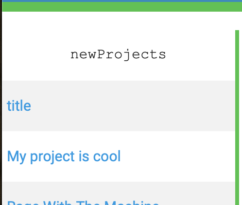
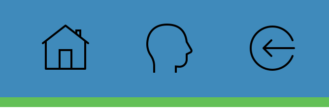
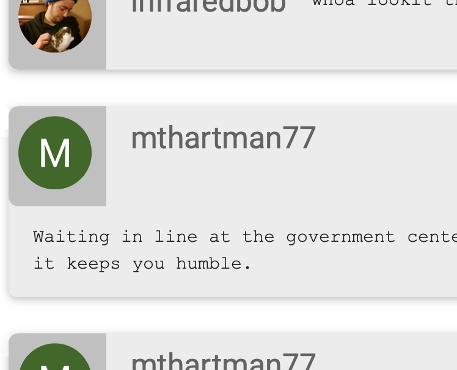

# FacePalm

FacePalm is built on a full MERN stack. This is the final Project to come from the University of Minnesota Bootcamp. It effectively utilizes our abilities to create a working web app back to front form the ground up. Users have the ability to log in, create profiles and create "projects" where text can be input and saved. Community posts also are displayed on the home page. You have the ability to post things upon logging in.

[View Live](https://face--palm.herokuapp.com/)

## Usage
Before logging in, you can only view things. Click items on list off to the left to view new projects and text from users.
The homepage displays user posts automatically, and an empty profile viewer.

Clear browsing history before attempting to log in. Simply use Google or sign up to log in.

When logged in, you are able to view your profile, and post content. If you visit your profile, you will see that you have the ability to create a project. You will also be able to view the projects that you have created.

### Original Project
This is a forked project. This version of the app is simply a cleaned up and updated version of the original. Elements are reorganized somewhat, and things slightly out of place are now appropriately positioned.

**Original:**
* [Github](https://github.com/LilGherkin/SyntactictSugar)
* [Live](https://syntactictsugar.herokuapp.com/)

## Built With
* [React](https://reactjs.org)
* [Materialize](https://materializecss.com)
* [Node](https://nodejs.org/en/)
* [Express](https://expressjs.com)
* [MongoDB](https://www.mongodb.com/what-is-mongodb)
* [Auth0](https://auth0.com)

## Authors
* [Ryan Scott](https://github.com/minerbob)
* [Mark Hartman](https://github.com/LilGherkin)
* [Hlee Vang](https://github.com/vanghlee01)
* John Ochs
